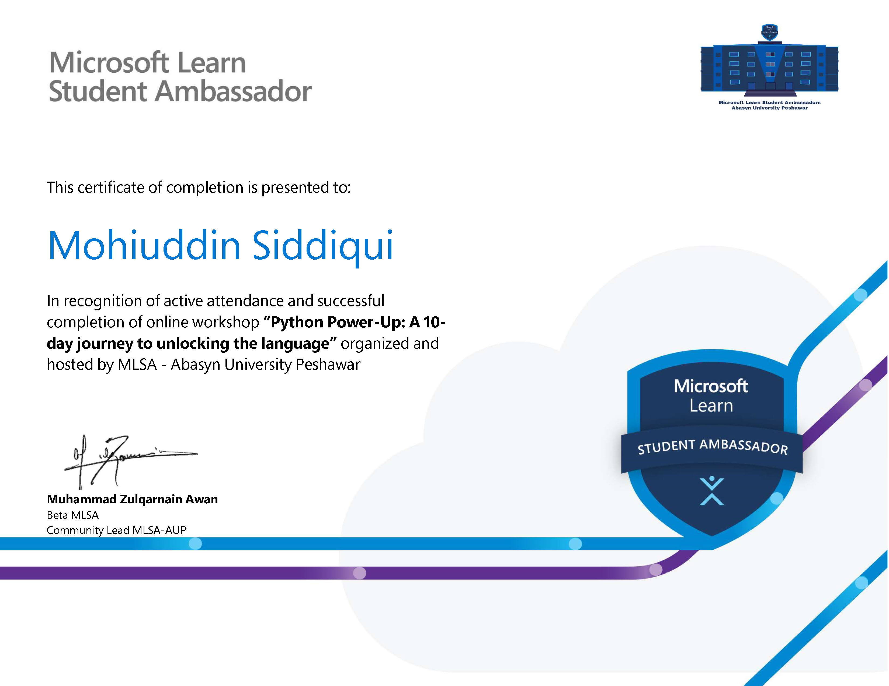

# Python Power-Up: 10-Day Course

This repository collects my coursework from **Python Power-Up: A 10-day journey to unlocking the language**, an online workshop organized by the Microsoft Learn Student Ambassadors at Abasyn University Peshawar. It brings together seven numbered assignment sets, a final Library Management System project, and my completion certificate.

## Topics covered

- Python fundamentals: input, conditionals, loops, functions, and modules
- Basic data structures: lists, tuples, and nested dictionaries
- Small programs and games: number guessing, Hangman, a calculator, and word counting
- Object-oriented programming: classes, inheritance, and method overriding
- File handling through the final project's pickle-based save and load methods

## Coursework

| Assignment | Exercises |
| --- | --- |
| [01](exercises/assignment-01/) | Number range and leap year checkers |
| [02](exercises/assignment-02/) | Lists and tuples; nested dictionaries |
| [03](exercises/assignment-03/) | Number guessing and [Hangman](exercises/assignment-03/hangman/) |
| [04](exercises/assignment-04/) | Calculator and word frequency counter |
| [05](exercises/assignment-05/) | Bank account and to-do list classes |
| [06](exercises/assignment-06/) | Single and hybrid inheritance |
| [07](exercises/assignment-07/) | Shopping cart with subclasses |

## Final project: Library Management System

The [Library Management System](projects/library-management-system/) uses separate classes for books, patrons, the library, and its catalog. Its example run demonstrates adding records, borrowing and returning books, reservation queues, overdue fines, an administrator role, and saving library data. The original [assignment brief](projects/library-management-system/docs/assignment-brief.txt) and [example usage](projects/library-management-system/docs/example-usage.txt) are included for context.

All coursework uses Python's standard library. To run the final project from the repository root:

```bash
cd projects/library-management-system
python main.py
```

The example run creates `test1.pickle` in the current directory. Generated pickle data, Python caches, and editor files are excluded from Git.

## Certificate



[Open the full-size certificate](certificate/python-power-up-certificate.jpg).
